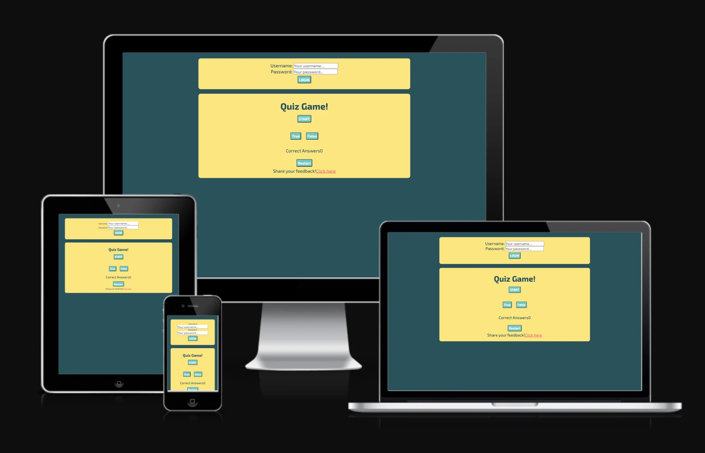
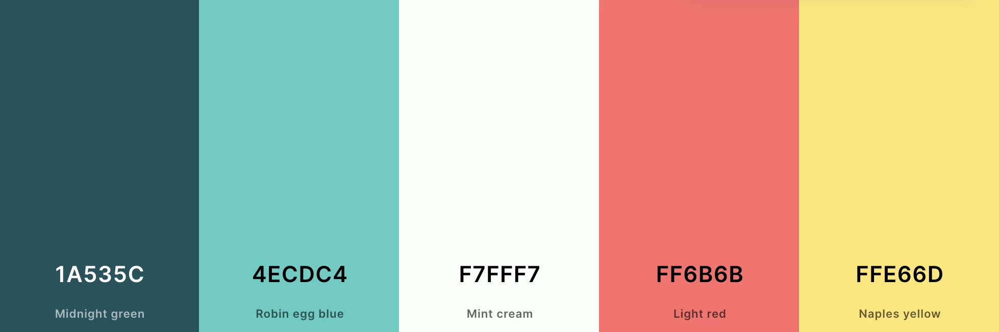
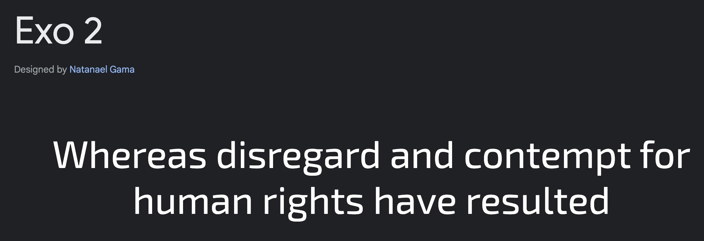
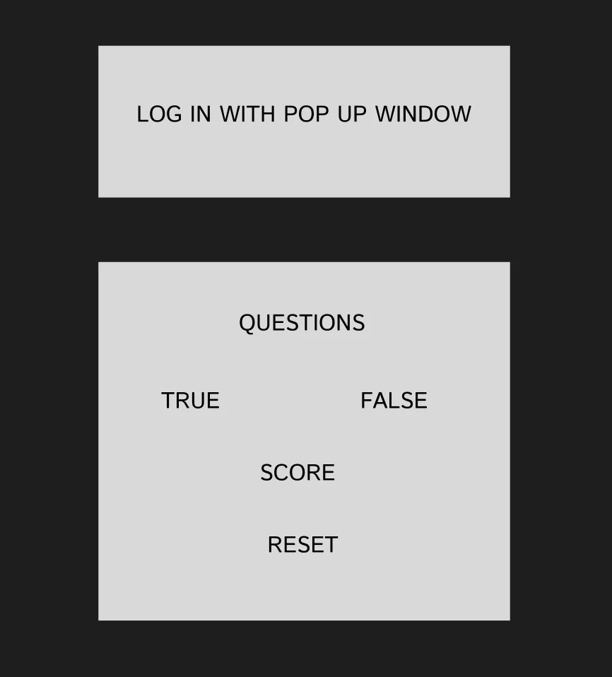
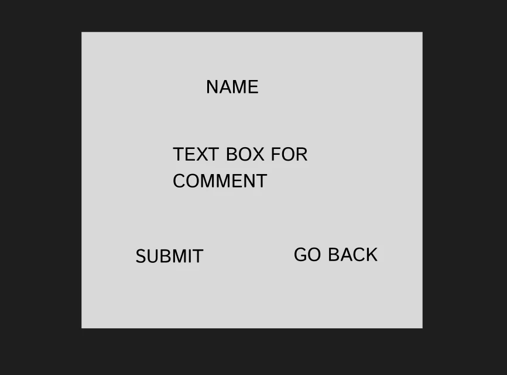
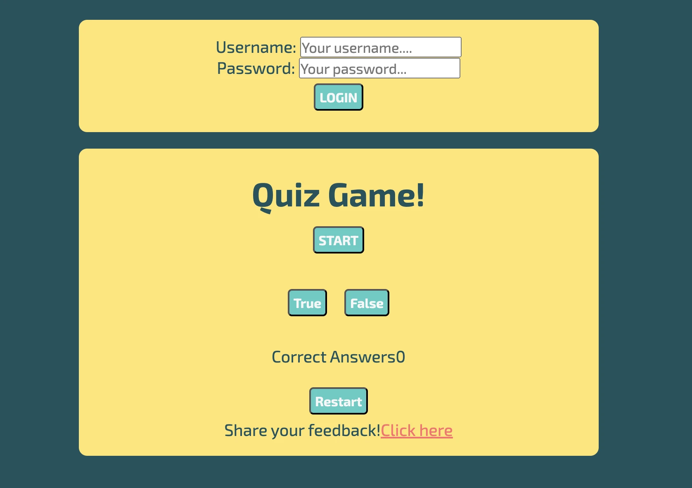
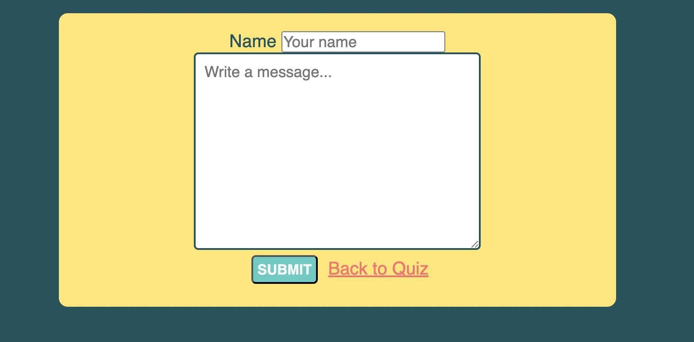
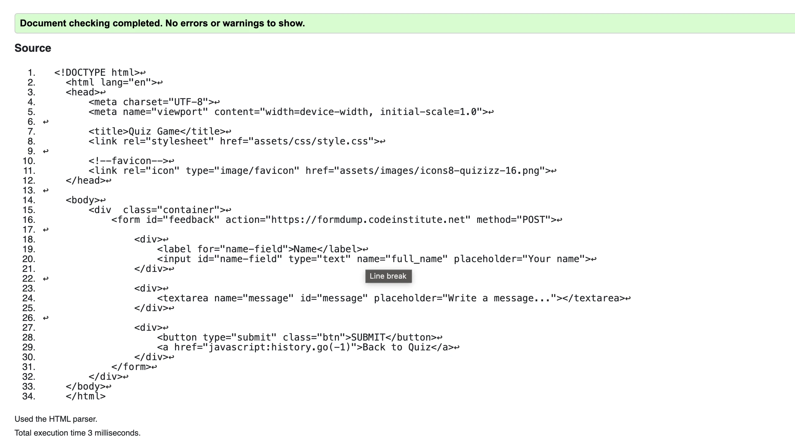
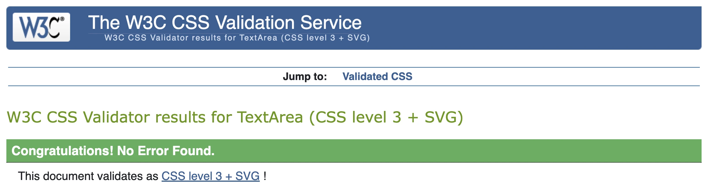
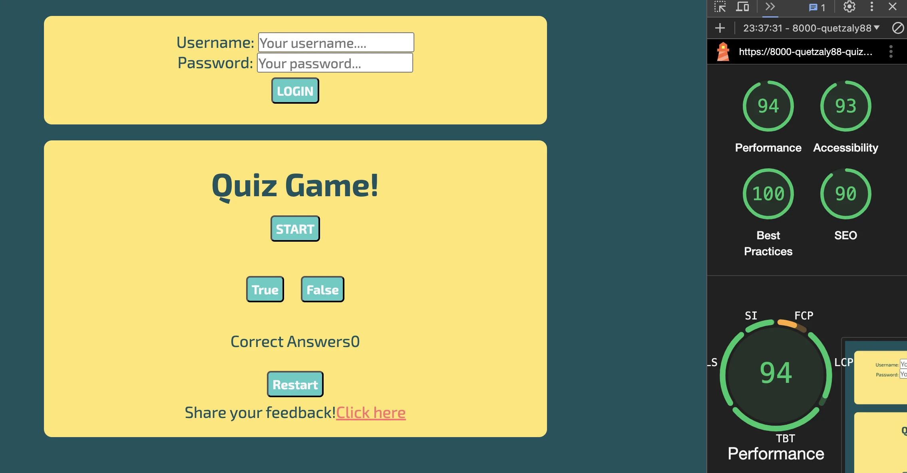

# Quiz-game
 
Project 2
Code Institute

This is a simple quiz game that tests your knowledge with true/false questions. This game includes: a log-in form, a set of questions, a track of your score and a form for feedback. 

DESIGN

* Colour Scheme

I choosed a pallet from coolors that is not so bright and makes that the quiz container color pops up more than the background color. The dark color was used in the back, the bright yellow in the quiz container and other colors were used in the buttons. 

* Typography

The chosen typography was adquired from google fonts. 
I chosed "Exo 2" for all the text because is a redable font and it suits a game. 

* Imagery

I haven't used any pictures for this project because it was mostly focused on the development of Javascript. But, I used just one image from favicons for the website representation. 
The image is displayed in the browser tab. 

The screenshots used for this readme file were transformed from png to webp using the webp converter. 

WIREFRAMES

Most wireframes were made old school with pen and paper. I have used FIGMA just for a quick representation in README. 

FEATURES

* The log in box:

Here is a simple log-in box that requires an e-mai adress. It prevents the default form submission behavior, shows an alert indicating that the user has logged in, hides the login form, and then displays the main content container. This provides a basic user interface response to a successful login. After the user has logged in the box dissapears giving more focus to the quiz container. 
The log in feature is optional. 

* The landing page image

The landing page includes the log-in box and the Quiz container.
Inside the quiz container we have different buttons:

- Start Button: When pushed, the title of "Quiz game" dissappears and instead the array of questions start to show.
- True and False buttons: The user chooses true or false and depending of the choice the "Correct Answer" increases. When all the array of questions has shown we have a message saying "You completed the quiz". 
- Reset Button: Any time during the game the user can push "Reset". The user can push restart and do the game over and over again. 
- Leave feedback button: At the end of the quiz we have share your feedback! and "Click here". When click here is pushed, a new page is loaded. 

* Feedback Form

Here the user can write their name and write a comment. When submited it just goes to Code institute fordump page. 

FUTURE IMPLEMENTATIONS

- I need to be more clear with class and division names. Less elements can lead me to less code and less confusion.
- I found Figma and I want to use it more. Is very useful for websites, designs, inspiration and even the wireframe.   
  True and False buttons go on top of each other. I've bee trying to figure out this but next time I will fix it. 
- Many useful sites are payed or need to be logged in. I feel is too much to do so I stayed with free websites. I the 
  future I can make use of those when I work with Web designing. 
- I couldn't make the submit form button to return to the main page but there is the Go back to quiz button instead. 
- When I was done with HTML, I realized that my divs and classes were messy so I changed them many times, 

ACCESIBILITY

The page is easy to read and understand. The user will be able to return to the main page from the feedback site. 
The colors are relaxing to the eye wich makes the user stay longer in the site. The font-families are friendly to dislexic users. In the project, I have include the sans-serif font family and "alt" to all images, which make easier for users with dissabilities to read. 

TECHNOLOGIES USED

* Languages Used:

As I'm learning more of coding, the langUages of this project are exclusively HTML & CSS and Javascript. 
I've been using Gitpod for editing the project and Github for deployment. 
I used Reddit to make changes that I didn't want to affect the project untill I was satisfied with those. Then, I writed my changes from Reddit to Gitpod. 
I have used some of Deftools specially the screen sizing.
Javascript was really difficult in the beginning but I got more comfortable when I finished my project. 

* Testing

- Log-in box, and all the buttons are responsive. 
- The site is avaiable and readable in on all devices. 
- HTML. No errors were returned when passing through the official W3C validator
- CSS. No errors were found when passing through the official (Jigsaw) validator
- JAVASCRIPT. There was an error that was fixed using /* jshint esversion: 6 */. I understand that is used to 
  standardize JavaScript. 

- The lighthouse open source from Chrome ensures that this website is not only fast and efficient but also accessible, SEO-friendly, and adhering to best practices.

* Bugs

I've been correcting and adjusting small mistakes in all the process of this project. 
I had a big problem which I was refering to the wrong element and the variables that I had from the beginning were not clear, therfore I had to erase some variables and make a new one just with current question. 
My experience was that I should't create too many variables and better to create them when I need them. 
I made some improvements and the quiz ended up functioning better.

Some other problems that I found are:
- Media query was difficult to adapt after I was done with most of the project. 
- I had to go back to CSS theory because of details that I couldn't remember. 
- JavaScript is a fun language but I need more projects to practice so I can apply more or the theory. 

* Deployment

The site was deployed to GitHub pages. The steps to deploy are as follows:

- In the GitHub repository, navigate to the Settings tab.
- From the "Code and automation" source select "pages"
- On Github Pages find "Source", choose "deploy from a branch".
- On branch you will find two dop-down menus. Choose "main", "root" and push the "save button".
- Once the master branch has been selected, the page will be automatically refreshed with a detailed ribbon display to indicate the successful deployment.
- The live link can be found here - https://github.com/Quetzaly88/Quiz-P2.git

* Code Used

Most of the code I used was from my notes, the Stack overflow site, and the Love Maths project. 
I realized that is hard to use the exact code from Replit because AI gives unacurate suggestions and I can't trust it. 
Some code that was auto filling or giving sugentions are useful fot time management but many times was very unacurate. 
I had assesory from a private teacher in Sweden (Superproff).  He made me think about several things that I could change so my project won't have too many functions and variables. 

* Credits

- Wellesley Education. Helped me understand the functions on Javascript. 
    https://cs.wellesley.edu/~cs115/readings/more-functions.html#fig4
- Kevin Powell CSS. 
    https://youtu.be/3elGSZSWTbM?feature=shared
- Superproff private teachers. 
    https://www.superprof.se/
- Freecode camp. I've been practicing javascript in their website. Freecode camp helped me code while I was applying theory from Code Institute. I used this website and Freecodecamp to practice and learn more.
    https://www.freecodecamp.org/news/how-to-loop-through-an-array-in-javascript-js-iterate-tutorial/
    https://www.freecodecamp.org/learn/javascript-algorithms-and-data-structures-v8/
    https://youtu.be/le-URjBhevE?feature=shared
- Developer Mozilla. Helped me understand the event listener for my log-in form. 
    https://developer.mozilla.org/en-US/docs/Web/API/EventTarget/addEventListener
- Replit. Helped me to write my code before I used gitpod. 
    https://replit.com/
- Stack Overflow. It works almost like slack. Here I found a lot of questions and answers about javascript. 
    https://stackoverflow.com/
- Chrome Devtools. As I'm still learning how to use them this is a great tool to see mistakes and improve them. 
- Pomodoro focus helped me have breaks and time to focus so my body doesn't get so stressed. 
    https://pomofocus.io/

* Media Content

- Mock up: https://ui.dev/amiresponsive
- Palette colors: https://coolors.co/
- Fonts: https://fonts.google.com/specimen/Exo+2?stroke=Sans+Serif&query=exo+2
- Fav icons: https://icons8.com/icons/set/quiz
- Webp converter app. https://anywebp.com/
- Wireframe: https://www.figma.com/design/bl6DMXwtOLRpX6XjRXwDif/Untitled?t=fSNs9KADQaAGOnzS-0

* Acknowledgments

I want to thank specially to Tarek Bermalm. He is my private teacher in Sweden. He was a big support, he explained me details that hepled me understand and learn more. 

I made a most of my code in Replit and after I tested and saw that everything was working fine I wrote the code in gitpod. One big issue about Replit is that the changes are not all the time uppdated, which made me re do alot of the code in gitpod. 

I got inspiration for this README from Kera_Hackteam. This README had my own template from Project N.1.  Some of the used websites are the same.  

The tutor team was avaiable most of the times I asked questions but because of the time it takes to get help I tried to do mostly everything by myself. 